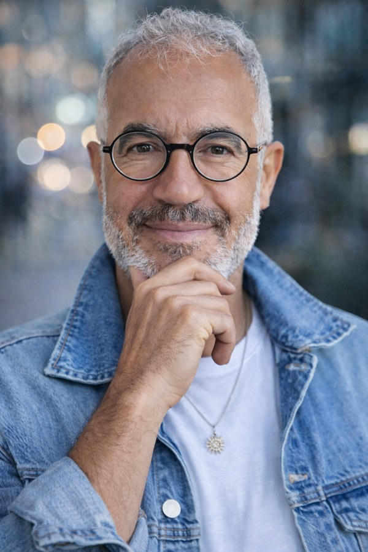

Rheumatology · Artificial intelligence · Health data

<h1>Zubeyir Salis</h1>

Junior Professor, University of Montpellier

My research focuses on osteoarthritis and inflammatory rheumatic diseases. I use epidemiology, machine learning and longitudinal health data to study disease risk and progression, predict outcomes and evaluate treatments.

I work with clinical cohorts, international registries and French national health data. My projects investigate clinical, environmental and biological factors, alongside treatment outcomes and the development of predictive models.

<aside class="profile-note" aria-label="Affiliation and profile">

<h2>Based in Montpellier, France</h2>

Faculty of Medicine PhyMedExp Inserm U1046 · CNRS UMR 9214

<a href="https://orcid.org/0000-0003-2982-4591">ORCID profile</a>
<a href="contact.html">Get in touch</a>
</aside>

## Research themes

<article class="theme"><h3><a href="research.html#prediction">Prediction in osteoarthritis and inflammatory rheumatic diseases</a></h3>
Predicting disease onset, progression, remission and treatment outcomes, and assessing whether models work in new populations.
</article>
<article class="theme"><h3><a href="research.html#osteoarthritis">Osteoarthritis: risk factors and disease progression</a></h3>
Studying pain, structural changes and function across joints, including their relationships with body weight, environmental exposures, metabolic factors and medication use.
</article>
<article class="theme"><h3><a href="research.html#environment">Environment, metabolism and the microbiome</a></h3>
Studying environmental exposures and biological factors that may contribute to rheumatic disease.
</article>
<article class="theme"><h3><a href="research.html#treatments">Treatment outcomes and population health</a></h3>
Using routine health data to investigate treatment effects, safety and multimorbidity.
</article>
<article class="theme"><h3><a href="research.html#digital-twins">Digital twins and clinical AI</a></h3>
Developing and evaluating approaches that connect patient data, computational models and clinical questions.
</article>

## Selected publications

<article class="selected-paper"><a href="https://doi.org/10.1002/art.70165">Machine Learning to Predict Remission Between Six and 24 Months in Rheumatoid Arthritis: Insights from the JAK-pot Collaboration</a>
Salis et al. · Arthritis &amp; Rheumatology · 2026
</article>
<article class="selected-paper"><a href="https://doi.org/10.1016/j.semarthrit.2024.152433">Predicting the onset of end-stage knee osteoarthritis over two- and five-years using machine learning</a>
Salis, Driban and McAlindon · Seminars in Arthritis and Rheumatism · 2024
</article>
<article class="selected-paper"><a href="https://doi.org/10.1002/art.42307">Association of Decrease in Body Mass Index With Reduced Incidence and Progression of the Structural Defects of Knee Osteoarthritis: A Prospective Multi-Cohort Study</a>
Salis et al. · Arthritis &amp; Rheumatology · 2022
</article>

[View publications](publications.html){: .section-link}

## From computer engineering to health research

Before moving into academic research, I worked in information technology and led a team of solution architects in Australia. That experience continues to shape how I build research workflows and approach complex health data.

<strong>Since 2024 · University of Montpellier</strong> Junior Professor in the Faculty of Medicine and PhyMedExp. I obtained my Habilitation à Diriger des Recherches (HDR) in 2026.

<strong>2023–2024 · University of Geneva</strong> Postdoctoral research in rheumatology, supported by a Swiss Government Excellence Scholarship.

<strong>2021–2024 · UNSW Sydney</strong> PhD in Public Health and Community Medicine, investigating weight loss and structural changes in knee and hip osteoarthritis.

